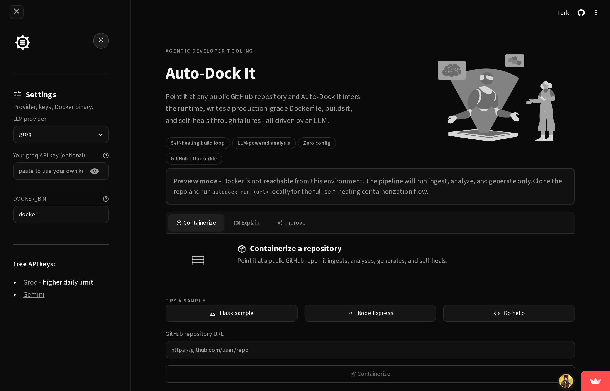
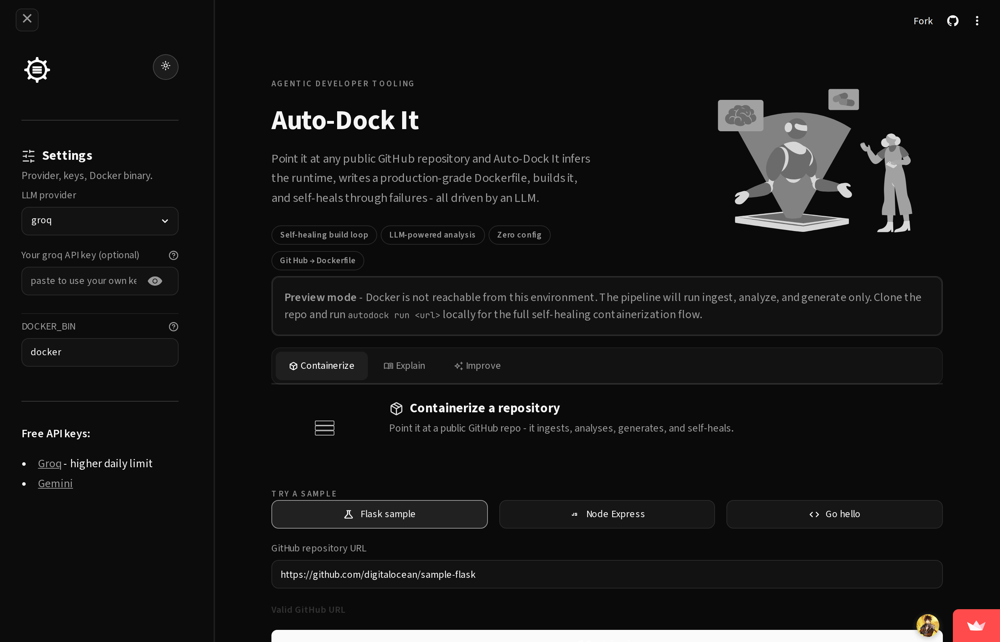
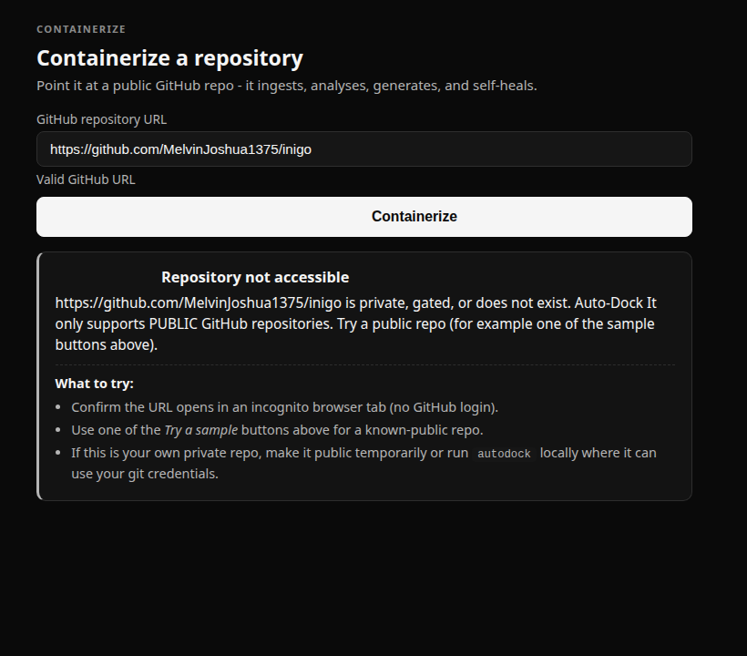

<p align="center">
  
</p>

<h1 align="center">Auto-Dock It</h1>

<p align="center">
  <strong>Point it at any public GitHub repository - it figures out the stack, writes a production-grade Dockerfile, builds it, and self-heals through failures. All driven by an LLM.</strong>
</p>

<p align="center">
  <a href="https://autodockit.streamlit.app"></a>
  <a href="https://codespaces.new/MelvinJoshua1375/auto-dock-it"></a>
  <a href="LICENSE"></a>
  <a href="https://www.python.org/downloads/"></a>
  <a href="https://github.com/astral-sh/ruff"></a>
  <a href="CONTRIBUTING.md"></a>
</p>

---

## Table of Contents

- [About](#about)
- [Problem Statement and Coverage](#problem-statement-and-coverage)
- [Is It Agentic?](#is-it-agentic)
- [What Makes It Different](#what-makes-it-different)
- [Pipeline](#pipeline)
- [Features](#features)
- [Screenshots](#screenshots)
- [Live Demo](#live-demo)
- [Demo Runs](#demo-runs)
- [Testing Evidence](#testing-evidence)
- [Installation](#installation)
- [Quick Start](#quick-start)
- [Web UI](#web-ui)
- [CLI Reference](#cli-reference)
- [Configuration](#configuration)
- [Deploy Your Own Instance](#deploy-your-own-instance)
- [Security Notes](#security-notes)
- [Build From Source](#build-from-source)
- [Contributing](#contributing)
- [Roadmap](#roadmap)
- [License](#license)
- [Contact](#contact)
- [Acknowledgements](#acknowledgements)

---

## About

Containerizing a repository is still a manual process for most teams. You look at the stack, write a Dockerfile, fight with build errors, tweak the CMD, realise the app needs an env var you forgot, and repeat. Tools like Nixpacks and Buildpacks automate the *happy path* only; the moment a repo is non-standard, you are on your own.

**Auto-Dock It** treats Dockerfile generation as an **agentic loop**:

1. Clone the repository and build a structured profile of the stack using an LLM.
2. Generate a Dockerfile (and `docker-compose.yml` for multi-service repos).
3. Run `docker build`. On failure, the truncated error is sent back to the LLM with the current Dockerfile; the model returns a patch; the build is retried.
4. Start the container and poll the exposed port for HTTP 2xx/3xx. On failure, container logs go back to the LLM for a second round of repair.

Every attempt is saved under `output/<run_id>/attempts/`, making the entire loop auditable.

---

## Problem Statement and Coverage

Auto-Dock It was built against an agentic-AI hackathon brief that asked for an LLM-powered tool capable of containerizing any public GitHub repository end to end. The table below maps each requirement from the brief to the implementation that ships in this repository.

| Brief requirement | Status | Where it lives |
|---|---|---|
| Clone public GitHub repository | Delivered | `autodock/ingest.py` (GitPython shallow clone, 200 MB cap, private-repo detection) |
| LLM-based code analysis | Delivered | `autodock/analyze.py` returns a structured `RepoProfile` via Gemini or Groq |
| Stack and framework detection | Delivered | Manifest readers + source-code env-var grep across Python, Node, Go, Java, Ruby, PHP |
| Automatic Dockerfile generation | Delivered | `autodock/generate.py` and `prompts/dockerfile.md` |
| Unified YAML/JSON config (ports, env, commands) | Delivered | `autodock.yaml` written per run |
| Docker Compose for multi-service apps | Delivered | `autodock/compose_runner.py` runs `docker compose up -d --build` with per-run project name |
| Health check / validation of the running container | Delivered | `autodock/validate.py` polls the exposed port for HTTP 2xx/3xx |
| Gemini or OpenAI API integration | Delivered with extras | Two providers (Gemini and Groq), BYOK in the web UI |
| CLI or web interface | Delivered both | Typer CLI (`autodock`) and Streamlit web UI |
| Parsers for `package.json`, `requirements.txt`, `pom.xml`, etc. | Delivered | Manifest snapshot pipeline in `analyze.py` |
| Optional hosting (Vercel, Netlify, Render) | Delivered | Live deploy at [autodockit.streamlit.app](https://autodockit.streamlit.app) and one-click [GitHub Codespaces](https://codespaces.new/MelvinJoshua1375/auto-dock-it) |
| Auto-generated explanation of a Dockerfile | Delivered | `autodock explain` |
| Submit generated Dockerfile as PR to upstream | Delivered | `autodock pr` forks + opens a PR |

**Built beyond the brief:**

- Self-healing build loop and runtime-repair loop (the agentic differentiator)
- Pre-flight repo accessibility check so private-repo URLs surface a polished error card instead of a stack trace
- Codespaces config so a reviewer can run the full pipeline in a browser in under two minutes
- Nine demo runs committed under [`demos/`](demos/) with full attempt history as evidence
- 112 pytest cases, ruff and Bandit clean, CI matrix across Python 3.10-3.13

---

## Is It Agentic?

Short answer: yes, on the canonical single-agent definition.

Auto-Dock It runs a closed observe / decide / act loop driven by an LLM:

- **Observation**: container build error, container runtime logs, validation HTTP response.
- **Decision**: the LLM reads the observation along with the current Dockerfile and decides whether to patch the Dockerfile, the source via `RUN sed`, or to give up.
- **Action**: the orchestrator writes the patched Dockerfile to disk and runs `docker build` (or `docker run`, or `docker compose up`).
- **Loop**: until the container responds with HTTP 2xx/3xx or the retry budget runs out.

Two nested loops fire in production:

| Loop | Trigger | Up to | Receipts |
|---|---|---|---|
| **Build self-healing** | `docker build` exits non-zero | 4 retries | [`demos/broken-flask/attempts/`](demos/broken-flask/attempts/) - LLM `sed`-patches a `flsk` typo at build time |
| **Runtime repair** | Container starts but app does not respond | 2 cycles | [`demos/runtime-loop-fired/`](demos/runtime-loop-fired/) - LLM reads `FileNotFoundError` for `pandoc`, adds `apt-get install -y pandoc` |

The canonical proof of both loops firing in one run is [`demos/jenkins-demo/`](demos/jenkins-demo/): the outer runtime-repair loop patched a bind-port mismatch (Flask listened on 8501, `EXPOSE` said 8000), the inner build-repair loop fixed a `USER`-ordering bug the first repair introduced, and the second build came back HTTP 200.

**Where Auto-Dock It is deliberately not multi-agent / long-horizon-planning:** containerization has a fixed five-stage shape (ingest, analyze, generate, build, validate). Splitting the stages across separate agents adds coordination overhead with no upside. Long-horizon planning would let the LLM invent new stages on the fly, which would trade reliability for cleverness. Single agent + stage-specific prompts is the right shape for this scope.

---

## What Makes It Different

| Capability | Nixpacks | Buildpacks | repo2docker | One-shot LLM | **Auto-Dock It** |
|---|:---:|:---:|:---:|:---:|:---:|
| Handles unusual or non-standard repos | partial | partial | no | partial | **yes** |
| Self-heals build errors | no | no | no | no | **yes** |
| Self-heals runtime errors | no | no | no | no | **yes** |
| Multi-service (Docker Compose) | no | no | no | partial | **yes** |
| Full audit trail of every attempt | no | no | no | no | **yes** |
| Bring-your-own LLM key (BYOK) | not applicable | not applicable | not applicable | not applicable | **yes** |
| Open source | yes | yes | yes | varies | **yes** |

---

## Pipeline

```
                ┌─────────┐   ┌─────────┐   ┌──────────┐   ┌──────────────┐   ┌──────────┐
 GitHub URL ──► │  Ingest │──►│ Analyze │──►│ Generate │──►│ Build (loop) │──►│ Validate │
                └─────────┘   └─────────┘   └──────────┘   └──────────────┘   └──────────┘
                     │              │              │                │                 │
               shallow clone   LLM builds    Dockerfile +    docker build       docker run
               200 MB cap      RepoProfile   compose.yml     ↺ LLM repair       + HTTP poll
                               from files    if multi-svc    on build error      ↺ LLM repair
                               + manifests                   (max 4 retries)     on bad logs

                every artifact → output/<run_id>/   (attempts/, usage.json, validation.txt)
```

Five stages, each writes to disk, and the full run is reproducible and auditable:

| Stage | What it does |
|---|---|
| **Ingest** | Shallow-clones the repo (depth 1, 200 MB cap). Validates the URL against `github.com` before any network call. |
| **Analyze** | Reads manifests, tree summary, README excerpt, entrypoint configs. Sends to LLM; returns a structured `RepoProfile`. Cached per commit SHA so re-runs skip the LLM call. |
| **Generate** | Writes `Dockerfile` from the profile. If `services` is non-empty, also writes `docker-compose.yml`. |
| **Build** | Runs `docker build`. On failure, the error is sent back with the current Dockerfile; the LLM returns a patch; retry. Up to `MAX_BUILD_RETRIES` (default 4). |
| **Validate** | Starts the container (or compose stack), polls the app's exposed port for HTTP 2xx/3xx. On failure, container logs go back to the LLM for up to 2 runtime-repair cycles. |

---

## Features

- **Self-healing build loop**: failed `docker build` outputs are fed back to the LLM for automated repair and retry.
- **Runtime-repair loop**: if the container starts but the app does not respond, container logs drive a second LLM repair cycle.
- **Docker Compose support**: auto-generates `docker-compose.yml` when multiple services are detected, with `docker compose port` for host-port discovery.
- **BYOK (bring your own key)**: paste your Gemini or Groq API key in the UI to bypass rate limits and use your own quota.
- **Full audit trail**: every attempt, the error that triggered the repair, and the patch are saved under `output/<run_id>/attempts/`.
- **Explain and Improve**: CLI and UI commands to get a line-by-line walkthrough of any Dockerfile and prioritised improvement suggestions with diffs.
- **PR back to upstream**: after a successful run, `autodock pr` forks the repo and opens a pull request with the generated artifacts.
- **Web UI**: a Streamlit dashboard with live log streaming, sample-repo buttons, a polished error card for private or 404 URLs, and Enter-to-submit on the URL field.
- **Free-tier friendly**: works with Gemini 2.5 Flash (20 requests per day free) and Groq Llama 3.3 70B (~14,000 requests per day free).
- **Security-hardened**: symlink path-traversal protection, LLM-output Dockerfile and Compose safety scans, prompt-injection guards, multi-user env isolation, optional `--network=none` builds.

---

## Screenshots

Live captures of the deployed web UI at [autodockit.streamlit.app](https://autodockit.streamlit.app), taken at viewport 1400 by 900.

**1. Landing page**

The hero copy, feature pills, the preview-mode banner explaining Streamlit Cloud has no Docker daemon, the Containerize / Explain / Improve tab strip, sample-repo quick buttons, and the URL input with the Containerize submit button.



**2. Sample repo populated**

After clicking the `Flask sample` quick button the URL field auto-fills, the inline validator confirms `Valid GitHub URL`, and the primary Containerize action is enabled.



**3. Private-repo error card**

If a private, gated, or missing GitHub URL is submitted, a 4-second pre-flight check intercepts the request before the pipeline subprocess starts, and a polished error card explains the situation directly under the Containerize button. A non-technical user does not have to read a Rich traceback to understand what went wrong.



**4. End-to-end agentic run on jenkins-demo**

A rendered transcript of run `20260530-225709-38a18f`. Two nested self-healing loops fire: the outer loop patches a bind-port mismatch, the inner loop fixes a `USER`-ordering bug the first repair introduced, and the container finally responds HTTP 200.


---

## Live Demo

The public demo at **[autodockit.streamlit.app](https://autodockit.streamlit.app)** runs in **preview mode** (ingest + analyze + generate) because Streamlit Cloud has no Docker daemon. Stages 4 and 5, the self-healing build and runtime-repair, require a real Docker daemon.

**To see the full loop:**

**Option A: GitHub Codespaces (free, around 60 seconds):**

[](https://codespaces.new/MelvinJoshua1375/auto-dock-it)

The `.devcontainer/` config pre-installs Python, Docker-in-Docker, and the package. Once the IDE loads:

```bash
export GEMINI_API_KEY=your_key_here   # free at aistudio.google.com
autodock run https://github.com/MelvinJoshua1375/githubactions-demo
```

Watch attempts land under `output/<run_id>/attempts/`, then a final HTTP 200 validation.

**Option B: Read captured runs** in [`demos/`](demos/). Each folder has every attempted Dockerfile, the build error, the repair, and `validation.txt`.

---

## Demo Runs

Nine real pipeline runs captured in [`demos/`](demos/):

| Demo | Stack | Self-healing | Outcome |
|---|---|---|---|
| [`jenkins-demo`](demos/jenkins-demo/) | Flask; bind port mismatch (8501 vs EXPOSE 8000) | 1 build + 2 repairs (1 nested) | HTTP 200; `sed` patched port, inner loop fixed `USER` ordering |
| [`flask`](demos/flask/) | Python + Flask + gunicorn | 1 build repair | HTTP 200 |
| [`nodejs`](demos/nodejs/) | Node + Express | 1 build repair | HTTP 200 |
| [`broken-flask`](demos/broken-flask/) | Flask with `flsk` typo in `requirements.txt` | 3 build repairs | HTTP 200; LLM `sed`-patched the typo at build time |
| [`flask-redis`](demos/flask-redis/) | Flask + Redis multi-service | None needed | HTTP 200; auto-generated `docker-compose.yml` |
| [`flask-postgres`](demos/flask-postgres/) | Flask + Postgres with `psycopg` | None needed | HTTP 200; compose with `postgres:16` sidecar |
| [`env-required-flask`](demos/env-required-flask/) | Flask requiring undeclared env var | 1 build repair | HTTP 200; source-code grep detected `REQUIRED_SECRET`, LLM added `ENV` |
| [`crashing-route-flask`](demos/crashing-route-flask/) | Flask route reads hardcoded `/etc/…` path | None needed | HTTP 200; LLM read `app.py`, spotted the path, added `RUN mkdir` |
| [`runtime-loop-fired`](demos/runtime-loop-fired/) | Flask shelling out to `pandoc` via subprocess | 1 build + 1 runtime repair | HTTP 200; build OK, validation 500, LLM read `FileNotFoundError` and added `RUN apt-get install -y pandoc` |

---

## Testing Evidence

| Signal | State | Evidence |
|---|---|---|
| Unit and integration tests | **112 passing** in under 3 seconds | `pytest -q` inside the [Codespaces environment](https://codespaces.new/MelvinJoshua1375/auto-dock-it) |
| Lint | clean | `ruff check autodock tests` |
| Static security | clean | `bandit -r autodock -ll` |
| Python coverage | 3.10, 3.11, 3.12, 3.13 | GitHub Actions matrix |
| Continuous integration | green on `main` | [Latest runs](https://github.com/MelvinJoshua1375/auto-dock-it/actions/workflows/ci.yml) |
| Self-healing loop, recorded | 9 captured runs | [`demos/`](demos/) |
| Nested loop, recorded | 1 captured run | [`demos/jenkins-demo/`](demos/jenkins-demo/) |
| Live web UI | up | [autodockit.streamlit.app](https://autodockit.streamlit.app) |

The test suite covers the run-id regex consumers (cleanup, CLI `list`, Streamlit artifact picker), the Dockerfile and Compose safety scanners, the symlink path-traversal guard, the source-code env-var grep, the LLM retry and rate-limit logic, the cost estimator, the cache round-trip, and the URL validator. LLM-driven stages are exercised by the nine demo runs which serve as integration evidence; they are intentionally not stubbed out in unit tests.

---

## Installation

### Prerequisites

- Python 3.10+
- Docker Engine 20+ (for build + validate stages)
- Docker Compose v2 (for multi-service repos)
- A free API key from [Google AI Studio](https://aistudio.google.com) (Gemini) or [Groq](https://console.groq.com) (both free-tier)

### Install

```bash
git clone https://github.com/MelvinJoshua1375/auto-dock-it.git
cd auto-dock-it
python -m venv .venv
source .venv/bin/activate          # Windows: .venv\Scripts\activate
pip install -e ".[dev,ui]"
cp .env.example .env
```

Open `.env` and paste at least one API key:

```env
LLM_PROVIDER=gemini                # or groq
GEMINI_API_KEY=your_key_here
# GROQ_API_KEY=your_key_here
```

Verify everything is wired up:

```bash
autodock doctor
```

---

## Quick Start

```bash
autodock run https://github.com/your-org/your-repo
```

The pipeline runs end-to-end. Artifacts land in `output/<run_id>/`:

```
output/
└── 20260601-143022-abc123/
    ├── attempts/
    │   ├── 0-Dockerfile          # first attempt
    │   ├── 0-build-error.txt     # why it failed
    │   ├── 1-Dockerfile          # LLM repair
    │   └── 1-build-success.txt
    ├── Dockerfile                # winner
    ├── docker-compose.yml        # if multi-service
    ├── autodock.yaml             # structured profile
    ├── usage.json                # token counts + cost estimate
    └── validation.txt            # HTTP response from the running container
```

---

## Web UI

```bash
streamlit run autodock/web.py
```

Opens at `http://localhost:8501`. Paste a GitHub URL, click **Containerize**, watch the agentic loop run with live log streaming.

The UI includes:
- **Containerize**: full pipeline with live output
- **Explain**: line-by-line walkthrough of any Dockerfile
- **Improve**: prioritised improvement suggestions with diffs
- **BYOK field**: paste your own Groq or Gemini key to bypass the public demo rate limit
- **Sample repos**: quick buttons to try Flask, Node, and Go hello-world repos
- **Light and dark toggle**: full black-and-white theme system

---

## CLI Reference

```
autodock doctor                                  Verify settings, LLM connection, Docker
autodock run <url-or-path>                       Full pipeline (ingest → validate)
autodock run <url> --dry-run                     Stop after Dockerfile generation (no Docker needed)
autodock list                                    Show recent runs with attempt counts and outcomes
autodock explain <Dockerfile>                    Line-by-line walkthrough of a Dockerfile
autodock improve <Dockerfile>                    Improvement suggestions with diffs
autodock pr output/<run_id>                      Fork upstream + open a PR with generated artifacts
autodock pr output/<run_id> --dry-run            Preview what the PR would look like
```

URL validation: only `https://github.com/owner/repo` URLs and existing local paths are accepted.

---

## Configuration

All settings are environment variables (read from `.env` at startup):

| Variable | Default | Description |
|---|---|---|
| `LLM_PROVIDER` | `gemini` | `gemini` or `groq` |
| `GEMINI_API_KEY` | none | Google AI Studio key (free tier available) |
| `GROQ_API_KEY` | none | Groq Console key (generous free tier) |
| `GEMINI_MODEL_FAST` | `gemini-2.5-flash` | Model for analysis and repair |
| `GEMINI_MODEL_STRONG` | `gemini-2.5-pro` | Model for complex generation |
| `GROQ_MODEL_FAST` | `llama-3.3-70b-versatile` | Groq model override |
| `GROQ_MODEL_STRONG` | `llama-3.3-70b-versatile` | Groq model override |
| `MAX_BUILD_RETRIES` | `4` | Self-healing loop budget (build stage) |
| `BUILD_TIMEOUT_SECONDS` | `600` | Per `docker build` timeout |
| `DOCKER_BIN` | `docker` | Docker binary path or prefix (e.g. `flatpak-spawn --host docker`) |
| `BUILD_NO_NETWORK` | `0` | Set to `1` to add `--network=none` to every build (for untrusted repos) |
| `KEEP_RECENT_RUNS` | `20` | Prune old runs in `output/` on each invocation |
| `AUTODOCK_CACHE_DIR` | `~/.cache/autodock` | Profile cache location |

---

## Deploy Your Own Instance

1. Fork or push this repo to GitHub (public).
2. Go to [share.streamlit.io](https://share.streamlit.io) → **New app** → select the repo → branch `main` → file `streamlit_app.py`.
3. **Settings -> Secrets**: paste the contents of `.streamlit/secrets.toml.example` with your keys filled in.

> The deployed instance runs in **preview mode** (no Docker daemon on Streamlit Cloud). For the full self-healing loop, run locally or in a Codespace.

---

## Security Notes

- **API keys** live in `.env` (gitignored, chmod 600). On Streamlit Cloud they go in the platform Secrets manager. Never committed.
- **Arbitrary code execution**: `docker build` runs `RUN` commands from the generated Dockerfile in an isolated build environment. You are still effectively running code from a public repo. Only point this at trusted sources, or run it in a throwaway VM / Codespace.
- **Symlink traversal protection**: the analyze stage refuses to read any file that is a symlink or whose resolved path lies outside the cloned repo directory.
- **Dockerfile safety scan**: every Dockerfile returned by the LLM is scanned by `assert_safe_dockerfile()` before being written to disk. Rejected patterns: `curl | sh`, `wget | bash`, `nc -e`, `/dev/tcp/`, hardcoded `ENV *_KEY=` / `ENV *_TOKEN=` / `ENV *_PASSWORD=`, `--privileged`.
- **Multi-user isolation**: the web UI never writes visitor API keys into `os.environ`. Keys are passed per-request through `load_settings(overrides=...)`.
- All `subprocess.run()` calls use argv-style (never `shell=True`).

---

## Build From Source

```bash
git clone https://github.com/MelvinJoshua1375/auto-dock-it.git
cd auto-dock-it
python -m venv .venv
source .venv/bin/activate
pip install -e ".[dev,ui]"

# Run tests
pytest -q

# Lint
ruff check autodock tests

# Security scan
bandit -r autodock -ll

# Web UI
streamlit run autodock/web.py
```

CI runs ruff, pytest (Python 3.10–3.13), and Bandit on every push.

---

## Contributing

Contributions are welcome across bug fixes, new LLM backends, demo repos, documentation, and UI improvements.

See **[CONTRIBUTING.md](CONTRIBUTING.md)** for the full guide.

**Quick steps:**

1. [Fork the repo](https://github.com/MelvinJoshua1375/auto-dock-it/fork)
2. Create a branch: `git checkout -b feature/your-feature`
3. Make changes and run `ruff check autodock tests && pytest -q`
4. Commit with a clear message
5. Open a pull request

[View open issues](https://github.com/MelvinJoshua1375/auto-dock-it/issues) · [Start a discussion](https://github.com/MelvinJoshua1375/auto-dock-it/discussions)

---

## Roadmap

Shipped features live in the [Changelog](CHANGELOG.md). Items below are not yet built and remain open. The list is deliberately short: every item here is a real product gain, not a checkbox.

- **Ollama / local LLM backend.** Fully offline, no API key required, no cloud egress. Closes the only remaining gap against the "open-source tools only" reading of the original brief and unlocks self-hosted use without BYOK.
- **Cross-run memory ("fleet memory").** Embed every successful repair (error fingerprint to patch diff) in a vector store; on a new failure retrieve top-K similar past fixes and prepend them to the repair prompt. Auto-Dock It learns from itself. Highest-leverage v2 feature.
- **Mermaid diagram in `autodock.yaml`.** Auto-render the detected service topology so the generated config doubles as architecture documentation.
- **GitHub Actions workflow template output.** Emit a `.github/workflows/build-and-push.yml` alongside the Dockerfile so the project ships with CI from day one.
- **Broader language coverage.** Demo runs and prompt-side hints for Rust (Cargo workspaces), Go (modules + `go.sum`), C# (csproj), Elixir (mix.exs).

---

## License

Released under the **MIT License**. See [LICENSE](LICENSE) for the full text.

---

## Contact

**Melvin Joshua**
- Email: [melvinjoshua1001@gmail.com](mailto:melvinjoshua1001@gmail.com?subject=Auto-Dock%20It)
- GitHub: [@MelvinJoshua1375](https://github.com/MelvinJoshua1375)
- LinkedIn: [melvin-joshua](https://www.linkedin.com/in/melvin-joshua/)

**Anand Sundaramoorthy SA**
- Email: [sanand03072005@gmail.com](mailto:sanand03072005@gmail.com?subject=Auto-Dock%20It)
- GitHub: [@anandsundaramoorthysa](https://github.com/anandsundaramoorthysa)
- LinkedIn: [anand-sundaramoorthy-sa](https://www.linkedin.com/in/anand-sundaramoorthy-sa-90002a306)

---

## Acknowledgements

Built with these excellent open-source projects:

| Library | Purpose |
|---|---|
| [Streamlit](https://github.com/streamlit/streamlit) | Web UI framework |
| [google-genai](https://github.com/googleapis/python-genai) | Gemini API client |
| [groq](https://github.com/groq/groq-python) | Groq API client |
| [GitPython](https://github.com/gitpython-developers/GitPython) | Repository cloning |
| [Pydantic](https://github.com/pydantic/pydantic) | Structured LLM output validation |
| [Typer](https://github.com/tiangolo/typer) | CLI framework |
| [Rich](https://github.com/Textualize/rich) | Terminal output formatting |
| [Ruff](https://github.com/astral-sh/ruff) | Linting and formatting |
| [Bandit](https://github.com/PyCQA/bandit) | Security scanning |
| [pytest](https://github.com/pytest-dev/pytest) | Test framework |

Thanks to the open-source community and everyone who has tested, starred, or contributed to this project.
