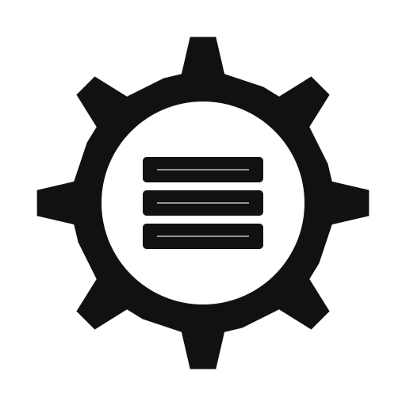
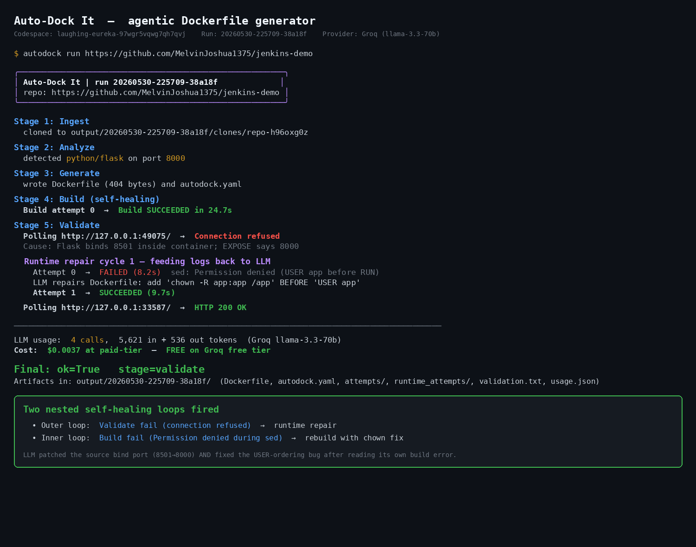

# Auto-Dock It

<p align="center">
  
</p>

[](https://auto-dock-it.streamlit.app)
[](https://codespaces.new/MelvinJoshua1375/auto-dock-it)
[](https://github.com/MelvinJoshua1375/auto-dock-it/actions/workflows/ci.yml)
[](https://codecov.io/gh/MelvinJoshua1375/auto-dock-it)
[](LICENSE)
[](https://www.python.org/downloads/)
[](https://github.com/astral-sh/ruff)

Agentic LLM tool that clones a public GitHub repository, figures out its stack, generates a Dockerfile (and `docker-compose.yml` when external services are needed), builds it with a self-healing loop, runs the container, and confirms the app actually responds.

## What makes it different

Existing tools either skip the LLM entirely (Nixpacks, Buildpacks, repo2docker) and break on unusual repos, or use an LLM in a one-shot "write me a Dockerfile" prompt and ship whatever comes back. This project does neither: it treats Dockerfile generation as an **agentic loop**. When `docker build` fails, the truncated error log goes back to the LLM with the current Dockerfile, the model returns a patch, and the build is retried. If the container builds but the app fails to respond on its port, the container logs are fed back for a second round of repair.

Every attempt is saved under `output/<run_id>/attempts/` so the whole loop is auditable.

### Comparison

| Tool | Approach | Handles unusual repos | Self-heals errors | Multi-service | Open-source |
|---|---|---|---|---|---|
| Nixpacks | Rule-based detection | Limited | No | No | Yes |
| Cloud Native Buildpacks | Curated builders per language | Limited | No | No | Yes |
| repo2docker | Jupyter-focused, rule-based | Jupyter only | No | No | Yes |
| One-shot LLM demos | Single prompt, no validation | Depends on model | No | No | Varies |
| **Auto-Dock It** | LLM + agentic loop + validation | Yes | Yes (build + runtime) | Yes | Yes |

## Pipeline

```
                   ┌────────┐    ┌────────┐    ┌──────────┐    ┌─────────────┐    ┌──────────┐
   github URL ───► │ Ingest │───►│ Analyze│───►│ Generate │───►│ Build (loop)│───►│ Validate │
                   └────────┘    └────────┘    └──────────┘    └─────────────┘    └──────────┘
                       │              │              │                │                  │
                  shallow clone   structured     Dockerfile +    docker build       docker run
                  (depth 1)       profile from   autodock.yaml   ↺ LLM repair on    + HTTP poll
                                  manifests +    + compose.yml   error              ↺ LLM repair
                                  LLM            if multi-svc                       on bad logs

                  every artifact saved under output/<run_id>/  →  audit trail
```

Five stages, each writes to disk so the run is reproducible and auditable:

1. **Ingest**: shallow clone, 200 MB cap.
2. **Analyze**: tree summary, manifest files, README excerpt, entrypoint configs (`gunicorn_config.py`, `wsgi.py`, etc.) fed to the LLM; returns a structured Pydantic `RepoProfile`. Cached per commit SHA so re-runs skip the LLM call.
3. **Generate**: Dockerfile from the profile. If `services` is non-empty, also generates `docker-compose.yml`.
4. **Build (self-healing)**: `docker build`; on failure, LLM repair, retry up to `MAX_BUILD_RETRIES` (default 4).
5. **Validate**: runs the container or compose stack, polls the app port for HTTP 2xx/3xx. On failure, up to 2 runtime-repair cycles feeding container logs back.

## See the agentic loop without installing anything

The public Streamlit demo at [auto-dock-it.streamlit.app](https://auto-dock-it.streamlit.app) runs **preview mode** (ingest + analyze + generate) because the Streamlit Cloud sandbox has no Docker daemon. The differentiator, the self-healing build and runtime-repair loop, lives in stages 4 and 5 and needs a real Docker daemon. Two ways to see it without a local install:

**Option A — Open in GitHub Codespaces (~60 seconds, free 60 hrs/month per GitHub account).** Click the Codespaces badge at the top of this README. The `.devcontainer/` config preinstalls Python, Docker-in-Docker, and `pip install -e .[dev,ui]`. Once the IDE loads, in the terminal:

```bash
export GEMINI_API_KEY=your_key_here   # get a free one at aistudio.google.com
autodock run https://github.com/MelvinJoshua1375/githubactions-demo
```

Watch attempts 0 → 1 → ... land under `output/<run_id>/attempts/`, then a final HTTP 200 validation.

**Option B — Read the captured runs in [`demos/`](demos/).** Each folder is a real pipeline run with every attempted Dockerfile, the build error that triggered the LLM repair, and the final `validation.txt`. Start with [`demos/runtime-loop-fired/`](demos/runtime-loop-fired/) where the agent installed `pandoc` after reading a `FileNotFoundError` from container logs, or [`demos/broken-flask/`](demos/broken-flask/) where it `sed`-patched a typo in `requirements.txt` at build time.

## Live agentic run on a fresh user repo

Below is a real end-to-end run on [`MelvinJoshua1375/jenkins-demo`](https://github.com/MelvinJoshua1375/jenkins-demo), executed inside a GitHub Codespace with Groq as the LLM. Two self-healing loops fired: an outer one when the built container did not actually serve traffic on the exposed port, and an inner one when the LLM's first repair attempt itself failed at build time. Full artifacts in [`demos/jenkins-demo/`](demos/jenkins-demo/).



## Demos

Nine runs captured in [`demos/`](demos/) with full attempt logs and per-run usage stats.

| Demo | Stack | Attempts | Outcome |
|---|---|---|---|
| [`demos/jenkins-demo`](demos/jenkins-demo/) | Flask web app from a real user repo; bind port mismatch (8501 inside vs EXPOSE 8000) | 1 build + 2 repairs (1 nested) | HTTP 200; outer loop patched `sed 8501->8000`, inner loop fixed `USER` ordering |
| [`demos/flask`](demos/flask/) | Python + Flask + gunicorn | 2 (1 build repair) | HTTP 200 |
| [`demos/nodejs`](demos/nodejs/) | Node + Express | 2 (1 build repair) | HTTP 200 |
| [`demos/broken-flask`](demos/broken-flask/) | Flask with `flsk` typo in requirements.txt | 4 (3 build repairs) | HTTP 200, LLM `sed`-patched the typo at build time |
| [`demos/flask-redis`](demos/flask-redis/) | Flask + Redis multi-service | 1 | HTTP 200, auto-generated compose file |
| [`demos/flask-postgres`](demos/flask-postgres/) | Flask + Postgres multi-service with `psycopg` | 1 | HTTP 200, compose file with `postgres:16` sidecar, env vars routed both as `DATABASE_URL` and discrete `POSTGRES_*` |
| [`demos/env-required-flask`](demos/env-required-flask/) | Flask that hard-requires an env var the manifests never mention | 2 (1 build repair) | HTTP 200, source-code env grep detected `REQUIRED_SECRET` and the LLM added it as `ENV` |
| [`demos/crashing-route-flask`](demos/crashing-route-flask/) | Flask whose route reads a hard-coded `/etc/...` path not in the repo | 1 | HTTP 200, LLM read `app.py`, spotted the path, added `RUN mkdir -p /etc/autodock && touch /etc/autodock/lookup.txt` to the Dockerfile |
| [`demos/runtime-loop-fired`](demos/runtime-loop-fired/) | Flask whose route shells out to `pandoc` via `subprocess`, hidden from the analyze step in a sub-package | 1 build + 1 runtime-repair | HTTP 200. Build succeeded; first validation returned 500 because the container could not find `pandoc`. The **runtime-repair loop** read the `FileNotFoundError` from container logs and added `RUN apt-get install -y pandoc`. Second validation passed. |

### What the loop actually fixed

In [`demos/flask/attempts/`](demos/flask/attempts/), attempt 0 fails on `chown: invalid group: 'appuser:appuser'` because `adduser --system --no-create-home appuser` on debian-slim doesn't create the group reliably. Attempt 1 replaces those two lines with a correct `addgroup --system` + `adduser --ingroup` pair and builds clean.

In [`demos/broken-flask/attempts/`](demos/broken-flask/attempts/), the winning Dockerfile contains:

```dockerfile
RUN sed -i 's/flsk/flask/g' requirements.txt
RUN pip install -r requirements.txt
```

The LLM diagnosed the typo from `pip install` output and patched the user's requirements at build time rather than asking a human to fix the repo.

## Install and run

```bash
git clone https://github.com/MelvinJoshua1375/auto-dock-it.git
cd auto-dock-it
python -m venv .venv
source .venv/bin/activate
pip install -e ".[dev,ui]"
cp .env.example .env          # paste your Gemini or Groq key
autodock doctor               # verify
autodock run https://github.com/<user>/<repo>
```

Inside a VSCode flatpak terminal, prefix `DOCKER_BIN="flatpak-spawn --host docker"` so the tool talks to the host's Docker daemon.

## LLM providers

Set `LLM_PROVIDER` in `.env`:

| Provider | Free-tier ceiling | Recommended model |
|---|---|---|
| `gemini` | 20 requests/day on Flash, 0 on Pro | `gemini-2.5-flash` |
| `groq` | ~14,000 requests/day | `llama-3.3-70b-versatile` |

The LLM layer handles 429 backoff using the provider's `retry-after` hint, applies a 60-second per-request timeout, and retries once on transient failures.

**Open-source scope.** The Auto-Dock It codebase is MIT licensed and depends only on open-source Python packages (`google-generativeai`, `groq`, `gitpython`, `pydantic`, `typer`, `rich`, `streamlit`). Gemini and Groq themselves are hosted proprietary model services accessed via free-tier API keys you supply (BYOK). A fully-local backend through Ollama is on the roadmap and would replace the hosted-model dependency for users who require an end-to-end open stack.

## CLI

```
autodock doctor                                 # smoke-test settings + LLM + Docker
autodock run <github-url-or-local-path>         # full pipeline
autodock run <url> --dry-run                    # stop after Dockerfile generation
autodock list                                   # show recent runs with outcomes
autodock explain <Dockerfile>                   # line-by-line walkthrough of an existing Dockerfile
autodock improve <Dockerfile>                   # prioritized improvement suggestions with diffs
autodock pr output/<run_id>                     # fork upstream and open a PR
autodock pr output/<run_id> --dry-run           # preview the PR without forking
```

URL validation: only `https://github.com/owner/repo` and existing local directories are accepted.

## Web UI

```
streamlit run autodock/web.py
```

Opens at http://localhost:8501. Paste a URL, click Containerize, watch the agentic loop run.

### Deployed preview at https://auto-dock-it.streamlit.app

Streamlit Cloud containers do not have Docker, so the public deployment runs in **preview mode**: ingest + analyze + generate only. Build, validate, and PR steps need a local Docker daemon.

To prevent quota abuse on the deployed preview, the UI enforces:

- 10-second cooldown between runs in one session,
- 3 runs per browser session,
- 50 runs per app instance per hour.

These are a circuit breaker, not real authentication. The longer-term fix is bring-your-own-key.

### Deploy your own

1. Fork or push this repo to your GitHub (public).
2. Visit https://share.streamlit.io, sign in, **New app**, select the repo, branch `main`, file `streamlit_app.py`.
3. **Settings → Secrets** → paste contents of [`.streamlit/secrets.toml.example`](.streamlit/secrets.toml.example) with your keys filled in.

## Configuration

All knobs are environment variables (read from `.env`):

| Variable | Default | Purpose |
|---|---|---|
| `LLM_PROVIDER` | `gemini` | `gemini` or `groq` |
| `GEMINI_API_KEY`, `GROQ_API_KEY` | required | At least one matching the provider |
| `GEMINI_MODEL_FAST`, `GEMINI_MODEL_STRONG` | 2.5 flash / pro | Override model IDs |
| `GROQ_MODEL_FAST`, `GROQ_MODEL_STRONG` | llama-3.3-70b | Override model IDs |
| `MAX_BUILD_RETRIES` | 4 | Self-healing loop budget |
| `BUILD_TIMEOUT_SECONDS` | 600 | Per `docker build` invocation |
| `DOCKER_BIN` | `docker` | Prefix the docker binary (eg `flatpak-spawn --host docker`) |
| `KEEP_RECENT_RUNS` | 20 | Older runs in `output/` are pruned on every new run |
| `AUTODOCK_CACHE_DIR` | `~/.cache/autodock` | Profile cache location |

## Open a PR back to the upstream repo

After a successful `autodock run`, the tool can fork the upstream repo and open a pull request with the generated Dockerfile, `autodock.yaml`, and `docker-compose.yml`.

One-time setup: `gh auth login` (in a host terminal).

```
autodock pr output/<run_id>                       # opens a real PR
autodock pr output/<run_id> --dry-run             # prints what it would do
```

If the upstream is owned by you, the tool skips the fork and pushes the branch directly.


## Development

```bash
pip install -e ".[dev,ui]"
ruff check autodock tests           # lint
pytest -q                           # 82 tests (parametrized), ~5s
pytest -q --cov=autodock            # with coverage
```

CI runs ruff, pytest across Python 3.10 - 3.13, and a Bandit security scan on every push. No commit-making automation (Dependabot, pre-commit.ci, release-please) is configured; dependency bumps are reviewed manually.

## Security notes

- API keys live in `.env` (chmod 600, gitignored). On Streamlit Cloud they live in the platform's Secrets manager.
- `autodock run` clones an arbitrary GitHub repo and runs `docker build` on it. `docker build` executes `RUN` commands from the Dockerfile in an isolated build environment, but you are still effectively running arbitrary code from a stranger's repo. Only point this at trusted sources, or run it in a throwaway VM.
- Repo URLs are validated against the `github.com` host before any network call.
- Old runs in `output/` are pruned on each invocation (default keep 20) so the directory doesn't grow unbounded.

## Requirements

- Python 3.10+
- Docker Engine 20+
- For multi-service repos: Docker Compose v2 (`sudo apt install docker-compose-v2`)
- For the PR feature: GitHub CLI (`gh`) authenticated via `gh auth login`

## License

MIT, see [LICENSE](LICENSE).
